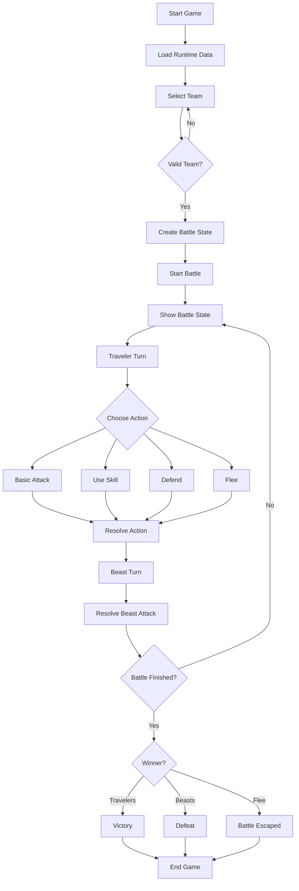

# Octopath Traveler Project Overview

## Project Summary

This is a C# Octopath Traveler-inspired battle simulator organized around Controller, Models, and View projects. The Controller coordinates runtime data loading, team selection, and battle execution. The Models project contains the core game rules, battle state, attacks, skills, passive effects, targeting, team validation, and runtime data parsing. The View project handles console and GUI presentation, including team selection, battle state display, and player turn input.

## Filtered Directory Tree

Only the Controller, Models, and View projects are included. `bin` and `obj` folders are excluded.

```text
Octopath-Traveler-Controller/ - Application flow and orchestration.
|-- Battle/ - Battle turn controller logic.
|   |-- Commands/ - Executable turn commands.
|   |   |-- BeastActionTurnCommand.cs - Executes beast turn action.
|   |   |-- TravelerBasicAttackTurnCommand.cs - Executes traveler basic attack turn.
|   |   |-- TravelerDefendTurnCommand.cs - Executes traveler defend turn.
|   |   |-- TravelerFleeTurnCommand.cs - Executes traveler flee turn.
|   |   `-- TravelerSkillTurnCommand.cs - Executes traveler skill turn.
|   |-- Loop/ - Battle round flow orchestration.
|   |   |-- BattleLoopRunner.cs - Runs battle round flow.
|   |   |-- RoundExecutionResult.cs - Stores round execution result.
|   |   |-- RoundExecutionState.cs - Tracks round execution state.
|   |   `-- RoundStepOutcome.cs - Represents one round step.
|   `-- Results/ - Controller-level battle outcomes.
|       `-- TurnExecutionOutcome.cs - Represents turn execution outcome.
|-- Exceptions/ - Controller exceptions.
|   `-- InvalidTeamSetupException.cs - Invalid team setup exception.
|-- Game.cs - Coordinates game execution.
|-- Octopath-Traveler-Controller.csproj - Controller project configuration.
`-- Program.cs - Application entry point.

Octopath-Traveler-Models/ - Game domain and data models.
|-- Battle/ - Battle domain logic.
|   |-- BeastAttacks/ - Beast attack modeling and execution.
|   |   |-- Core/
|   |   |   `-- BeastAttack.cs - Represents beast attack.
|   |   |-- Damage/
|   |   |   |-- BeastAttackDamageCalculator.cs - Calculates beast attack damage.
|   |   |   |-- BeastAttackDamageKind.cs - Defines beast damage types.
|   |   |   |-- BeastAttackDamageProfile.cs - Stores beast damage profile.
|   |   |   |-- BeastAttackDamageProfileFactory.cs - Builds beast damage profiles.
|   |   |   `-- BeastAttackDamageRequest.cs - Beast damage request data.
|   |   |-- Execution/
|   |   |   |-- BeastAttackExecutor.cs - Executes beast attacks.
|   |   |   |-- BeastAttackHitExecutionRequest.cs - Beast hit execution request.
|   |   |   `-- BeastAttackHitExecutor.cs - Executes beast attack hits.
|   |   |-- HitCalculation/
|   |   |   |-- BeastHitCalculation.cs - Beast hit calculation result.
|   |   |   |-- BeastHitCalculationRequest.cs - Beast hit calculation request.
|   |   |   |-- BeastHitRequest.cs - Beast hit request data.
|   |   |   `-- BeastHitStatusCalculation.cs - Calculates beast hit status.
|   |   |-- Results/
|   |   |   |-- BeastAttackDamageResult.cs - Beast damage result.
|   |   |   |-- BeastAttackDefendResult.cs - Beast defend result.
|   |   |   |-- BeastAttackHitResult.cs - Beast hit result data.
|   |   |   |-- BeastAttackHpSummaryResult.cs - Beast HP summary result.
|   |   |   |-- BeastAttackResult.cs - Beast attack result.
|   |   |   |-- BeastAttackReviveResult.cs - Beast revive result.
|   |   |   `-- BeastAttackStatusEffectResult.cs - Beast status effect result.
|   |   `-- Targeting/
|   |       |-- BeastAttackTargetSelectionRequest.cs - Beast target selection request.
|   |       `-- BeastAttackTargetSelector.cs - Selects beast attack targets.
|   |-- Core/ - Central battle state and winner logic.
|   |   |-- BattleSide.cs - Defines battle sides.
|   |   |-- BattleState.cs - Stores battle state.
|   |   |-- BattleWinner.cs - Represents battle winner.
|   |   |-- BattleWinnerEvaluator.cs - Evaluates battle winner.
|   |   `-- TeamSetupBattleStateFactory.cs - Creates battle state from team setup.
|   |-- Damage/ - Shared damage and hit concepts.
|   |   |-- BeastDamageResolution.cs - Beast damage resolution data.
|   |   |-- BeastDamageResolver.cs - Resolves beast damage.
|   |   |-- BreakingPointAttempt.cs - Represents breaking point attempt.
|   |   |-- DamageCapType.cs - Defines damage cap types.
|   |   |-- HitStatus.cs - Defines hit statuses.
|   |   |-- StatusDamageContext.cs - Carries status damage context.
|   |   |-- TravelerDamageApplication.cs - Traveler damage application data.
|   |   |-- TravelerDamageApplicationResult.cs - Traveler damage application result.
|   |   `-- TravelerDamageApplier.cs - Applies damage to travelers.
|   |-- Exceptions/
|   |   `-- BattleStateCreationException.cs - Battle creation exception.
|   |-- PassiveSkills/ - Passive skill behavior, profiles, and notifications.
|   |   |-- Contexts/
|   |   |   |-- PassiveExtraTurnEligibilityContext.cs - Extra turn eligibility context.
|   |   |   `-- RoundEndPassiveRecoveryContext.cs - Round-end recovery context.
|   |   |-- Handlers/
|   |   |   |-- ExtraTurnPassiveSkillHandler.cs - Handles extra turn passives.
|   |   |   |-- PatiencePassiveSkillHandler.cs - Handles patience passive.
|   |   |   |-- RoundEndPassiveSkillHandler.cs - Handles round-end passives.
|   |   |   |-- SecondWindPassiveSkillHandler.cs - Handles second wind passive.
|   |   |   |-- TravelerPassiveSkillHandler.cs - Base traveler passive handler.
|   |   |   `-- VimAndVigorPassiveSkillHandler.cs - Handles vim and vigor passive.
|   |   |-- Notifiers/
|   |   |   |-- PassiveSkillNotifier.cs - Passive notification data.
|   |   |   |-- PassiveSkillNotifierBuilder.cs - Builds passive notifications.
|   |   |   `-- PassiveSkillNotifierFactory.cs - Creates passive notifiers.
|   |   `-- Profiles/
|   |       |-- PassiveSkillProfile.cs - Passive skill profile data.
|   |       |-- PassiveSkillProfileBuilder.cs - Builds passive skill profiles.
|   |       |-- PassiveSkillProfileFactory.cs - Creates passive skill profiles.
|   |       `-- PassiveStatBonus.cs - Passive stat bonus data.
|   |-- TravelerBasicAttacks/ - Traveler basic attack modeling and execution.
|   |   |-- Core/
|   |   |   `-- TravelerBasicAttack.cs - Represents traveler basic attack.
|   |   |-- Damage/
|   |   |   `-- PhysicalAttackDamageCalculator.cs - Calculates physical attack damage.
|   |   |-- Execution/
|   |   |   |-- PhysicalAttackExecutionService.cs - Executes shared physical attack logic.
|   |   |   |-- TravelerBasicAttackExecutionRequest.cs - Traveler basic attack request.
|   |   |   |-- TravelerBasicAttackExecutor.cs - Executes traveler basic attacks.
|   |   |   |-- TravelerBasicAttackHit.cs - Traveler basic attack hit data.
|   |   |   |-- TravelerBasicAttackHitExecutionRequest.cs - Traveler basic attack hit request.
|   |   |   `-- TravelerBasicAttackHitExecutor.cs - Executes traveler basic attack hits.
|   |   `-- Results/
|   |       |-- PhysicalAttackOutcome.cs - Physical attack outcome data.
|   |       `-- TravelerBasicAttackSpRecoveryResult.cs - Basic attack SP recovery result.
|   |-- TravelerSkills/ - Traveler skill behavior, effects, targeting, and results.
|   |   |-- Behaviors/
|   |   |   |-- ExactNameTravelerSkillBehavior.cs - Matches exact skill names.
|   |   |   |-- SkillNameSetTravelerSkillBehavior.cs - Matches skill name sets.
|   |   |   `-- TravelerSkillBehavior.cs - Base traveler skill behavior.
|   |   |-- Boosting/
|   |   |   |-- SkillBoostRule.cs - Skill boost rule data.
|   |   |   `-- TravelerSkillBoostCalculator.cs - Calculates skill boost effects.
|   |   |-- Core/
|   |   |   |-- TravelerDivineSkillCatalog.cs - Catalogs divine traveler skills.
|   |   |   `-- TravelerSkillAction.cs - Traveler skill action data.
|   |   |-- Damage/
|   |   |   |-- TravelerSkillDamageBonusProfile.cs - Skill damage bonus profile.
|   |   |   |-- TravelerSkillDamageProfile.cs - Skill damage profile.
|   |   |   `-- TravelerSkillHitCountResolver.cs - Resolves skill hit counts.
|   |   |-- Effects/
|   |   |   |-- AelfricsAuspicesTravelerSkillEffect.cs - Aelfrics skill effect.
|   |   |   |-- BeastDamageTravelerSkillEffect.cs - Beast damage skill effect.
|   |   |   |-- DecreaseBeastPriorityTravelerSkillEffect.cs - Decreases beast priority.
|   |   |   |-- ElementalBreakTravelerSkillEffect.cs - Applies elemental break effect.
|   |   |   |-- EtherealHealingTravelerSkillEffect.cs - Applies ethereal healing.
|   |   |   |-- HpThiefTravelerSkillEffect.cs - Applies HP thief effect.
|   |   |   |-- LastStandTravelerSkillEffect.cs - Applies last stand effect.
|   |   |   |-- MercyStrikeTravelerSkillEffect.cs - Applies mercy strike effect.
|   |   |   |-- OrderedDamageTypesTravelerSkillEffect.cs - Applies ordered damage type effects.
|   |   |   |-- QueueTravelerPriorityTravelerSkillEffect.cs - Queues traveler priority changes.
|   |   |   |-- ReviveSelectedTravelerSkillEffect.cs - Revives selected travelers.
|   |   |   |-- ReviveTravelersSkillEffect.cs - Revives traveler targets.
|   |   |   |-- SealticgesSeductionTravelerSkillEffect.cs - Applies Sealticge's Seduction.
|   |   |   |-- SelectedWeaponBeastDamageTravelerSkillEffect.cs - Damages beasts with selected weapon.
|   |   |   |-- ShootingStarsTravelerSkillEffect.cs - Applies Shooting Stars.
|   |   |   |-- StealSpTravelerSkillEffect.cs - Applies SP steal effect.
|   |   |   |-- SteorrasProphecyTravelerSkillEffect.cs - Applies Steorra's Prophecy.
|   |   |   |-- TravelerHealingSkillEffect.cs - Base healing skill effect.
|   |   |   |-- TravelerSkillEffect.cs - Base traveler skill effect.
|   |   |   |-- TravelerSkillEffectContext.cs - Traveler skill effect context.
|   |   |   `-- TravelerStatusEffectSkillEffect.cs - Applies traveler status effects.
|   |   |-- Execution/
|   |   |   |-- TravelerSkillExecutionContext.cs - Traveler skill execution context.
|   |   |   |-- TravelerSkillExecutionRequest.cs - Traveler skill execution request.
|   |   |   `-- TravelerSkillExecutor.cs - Executes traveler skills.
|   |   |-- Results/
|   |   |   |-- TravelerSkillActivationDuplicationStatusResult.cs - Skill duplication status result.
|   |   |   |-- TravelerSkillBreakingPointResult.cs - Skill breaking point result.
|   |   |   |-- TravelerSkillDamageResult.cs - Skill damage result.
|   |   |   |-- TravelerSkillHealingResult.cs - Skill healing result.
|   |   |   |-- TravelerSkillHpRestorationStatusResult.cs - HP restoration status result.
|   |   |   |-- TravelerSkillHpSummaryResult.cs - Skill HP summary result.
|   |   |   |-- TravelerSkillPriorityChangeResult.cs - Skill priority change result.
|   |   |   |-- TravelerSkillResult.cs - Traveler skill result data.
|   |   |   |-- TravelerSkillReviveResult.cs - Skill revive result.
|   |   |   |-- TravelerSkillSpRecoveryResult.cs - Skill SP recovery result.
|   |   |   |-- TravelerSkillStatusEffectResult.cs - Skill status effect result.
|   |   |   `-- TravelerSkillTargetModificationStatusResult.cs - Target modification status result.
|   |   `-- Targeting/
|   |       |-- AllAliveBeastsTravelerSkillTargetSelector.cs - Selects all living beasts.
|   |       |-- AllAliveTravelersTravelerSkillTargetSelector.cs - Selects all living travelers.
|   |       |-- AllDefeatedTravelersTravelerSkillTargetSelector.cs - Selects defeated travelers.
|   |       |-- BeastSingleTargetSelector.cs - Selects one beast by rule.
|   |       |-- EligibleTravelersTravelerSkillTargetSelector.cs - Selects eligible travelers.
|   |       |-- HighestCurrentHpBeastSingleTargetSelector.cs - Selects highest HP beast.
|   |       |-- HighestElemAtkBeastSingleTargetSelector.cs - Selects highest elemental attacker.
|   |       |-- HighestPhysDefBeastSingleTargetSelector.cs - Selects highest physical defender.
|   |       |-- HighestSpeedBeastSingleTargetSelector.cs - Selects fastest beast.
|   |       |-- HighestSpeedBeastTravelerSkillTargetSelector.cs - Targets fastest beast.
|   |       |-- LowestCurrentHpBeastTravelerSkillTargetSelector.cs - Targets lowest HP beast.
|   |       |-- LowestElemDefBeastSingleTargetSelector.cs - Selects weakest elemental defender.
|   |       |-- LowestPhysDefBeastSingleTargetSelector.cs - Selects weakest physical defender.
|   |       |-- LowestPhysDefBeastTravelerSkillTargetSelector.cs - Targets weakest physical defender.
|   |       |-- NoTravelerSkillTargetSelector.cs - Selects no traveler target.
|   |       |-- OneBeastTravelerSkillTargetSelector.cs - Selects one beast target.
|   |       |-- OneTravelerTravelerSkillTargetSelector.cs - Selects one traveler target.
|   |       |-- OrderedBeastTravelerSkillTargetSelector.cs - Selects ordered beast targets.
|   |       |-- OrderedSkillNameSetBeastSingleTargetSelector.cs - Selects beasts by ordered skill names.
|   |       |-- SkillNameSetBeastSingleTargetSelector.cs - Selects beasts by skill names.
|   |       |-- SkillTargetTypeTravelerSkillTargetSelector.cs - Selects targets by skill target type.
|   |       |-- TravelerSkillTargetSelection.cs - Traveler skill target selection data.
|   |       |-- TravelerSkillTargetSelectionContext.cs - Traveler skill target selection context.
|   |       |-- TravelerSkillTargetSelector.cs - Base traveler skill target selector.
|   |       `-- UserTravelerSkillTargetSelector.cs - Selects user-provided traveler skill targets.
|   |-- Turns/ - Turn queues, participants, and turn outcomes.
|   |   |-- RoundTurnQueueBuilder.cs - Builds round turn queues.
|   |   |-- RoundTurnQueues.cs - Stores round turn queues.
|   |   |-- TravelerTurnOutcome.cs - Traveler turn outcome data.
|   |   |-- TravelerTurnResolution.cs - Traveler turn resolution data.
|   |   |-- TurnParticipant.cs - Represents turn participant.
|   |   |-- TurnParticipantKey.cs - Identifies turn participants.
|   |   `-- TurnQueueProjection.cs - Projects turn queue display data.
|   `-- Units/ - Combat unit models and status effects.
|       |-- BeastCombatUnit.cs - Beast combat unit model.
|       |-- TravelerCombatUnit.cs - Traveler combat unit model.
|       |-- Unit.cs - Base combat unit.
|       |-- UnitStatusEffect.cs - Unit status effect data.
|       `-- UnitStatusEffectKind.cs - Defines unit status effect kinds.
|-- RuntimeData/ - Runtime data loading models.
|   |-- Catalog/
|   |   |-- RuntimeDataCatalog.cs - Runtime data catalog.
|   |   |-- RuntimeDataCatalogFactory.cs - Builds runtime data catalog.
|   |   |-- RuntimeDataCatalogProvider.cs - Provides runtime data catalog.
|   |   `-- RuntimeDataDefinitions.cs - Groups runtime data definitions.
|   |-- Constants/
|   |   |-- RuntimeDataFileNames.cs - Runtime data file name constants.
|   |   `-- RuntimeDataPropertyNames.cs - Runtime data JSON property constants.
|   |-- Definitions/
|   |   |-- BeastDefinition.cs - Beast definition data.
|   |   |-- BeastSkillDefinition.cs - Beast skill definition data.
|   |   |-- PassiveSkillDefinition.cs - Passive skill definition data.
|   |   |-- SkillDefinition.cs - Skill definition data.
|   |   `-- TravelerDefinition.cs - Traveler definition data.
|   |-- Exceptions/
|   |   `-- RuntimeDataCatalogLoadException.cs - Runtime data catalog load exception.
|   `-- Parsing/
|       |-- BeastDefinitionParser.cs - Parses beast definitions.
|       |-- BeastSkillDefinitionParser.cs - Parses beast skill definitions.
|       |-- PassiveSkillDefinitionParser.cs - Parses passive skill definitions.
|       |-- RuntimeDataFileReader.cs - Reads runtime data files.
|       |-- RuntimeDataJsonParser.cs - Parses runtime JSON data.
|       |-- RuntimeDataJsonReader.cs - Reads runtime JSON data.
|       |-- SkillDefinitionParser.cs - Parses skill definitions.
|       `-- TravelerDefinitionParser.cs - Parses traveler definitions.
|-- TeamSelection/ - Team selection models.
|   |-- Exceptions/
|   |   |-- TeamFileParseException.cs - Team file parse exception.
|   |   `-- ValidationCatalogLoadException.cs - Validation catalog load exception.
|   |-- Parsing/
|   |   |-- SectionLines.cs - Stores parsed section lines.
|   |   |-- SectionLinesBuilder.cs - Builds section line groups.
|   |   |-- TeamFileParser.cs - Parses team files.
|   |   `-- TeamFileSection.cs - Represents team file section.
|   |-- Setup/
|   |   |-- TeamSetup.cs - Stores selected team setup.
|   |   `-- TravelerSetup.cs - Stores traveler setup.
|   `-- Validation/
|       |-- JsonValidationCatalogProvider.cs - Provides validation catalog JSON.
|       |-- TeamSetupValidator.cs - Validates selected team setup.
|       `-- ValidationCatalog.cs - Stores validation catalog.
`-- Octopath-Traveler-Models.csproj - Models project configuration.

Octopath-Traveler-View/ - Console and GUI presentation.
|-- Battle/ - Battle input and display views.
|   |-- BasicAttackSelection.cs - Basic attack selection data.
|   |-- BattleActionView.cs - Displays battle actions.
|   |-- BattleConsoleView.cs - Console battle interface.
|   |-- BattleStateView.cs - Displays battle state.
|   |-- TravelerActionOption.cs - Traveler action option data.
|   |-- TravelerSkillInputPlan.cs - Skill input planning data.
|   |-- TravelerSkillSelection.cs - Traveler skill selection data.
|   |-- TravelerSkillTargetInputKind.cs - Skill target input type.
|   |-- TravelerTurnInputView.cs - Reads traveler turn input.
|   |-- TravelerTurnOutcomeFactory.cs - Creates turn outcome views.
|   |-- TravelerTurnSelectionPolicy.cs - Handles turn selection rules.
|   `-- TravelerTurnSelections.cs - Stores turn selections.
|-- GuiLib/ - External GUI library files.
|   |-- .DS_Store - macOS folder metadata.
|   `-- OctopathTravelerGUI.dll - External GUI dependency.
|-- Main/ - Main menu view.
|   `-- MainConsoleView.cs - Console main menu view.
|-- TeamSelection/ - Team selection views.
|   `-- TeamSelectionView.cs - Displays team selection flow.
|-- AbstractView.cs - Base view abstraction.
|-- ConsoleView.cs - Shared console view behavior.
|-- InvalidInputRequestException.cs - Invalid input request exception.
|-- ManualTestingView.cs - Manual testing view.
|-- Octopath-Traveler-View.csproj - View project configuration.
|-- Script.cs - GUI script entry.
|-- TestingView.cs - Testing view implementation.
`-- View.cs - Main GUI view.
```

## General Game Flow


